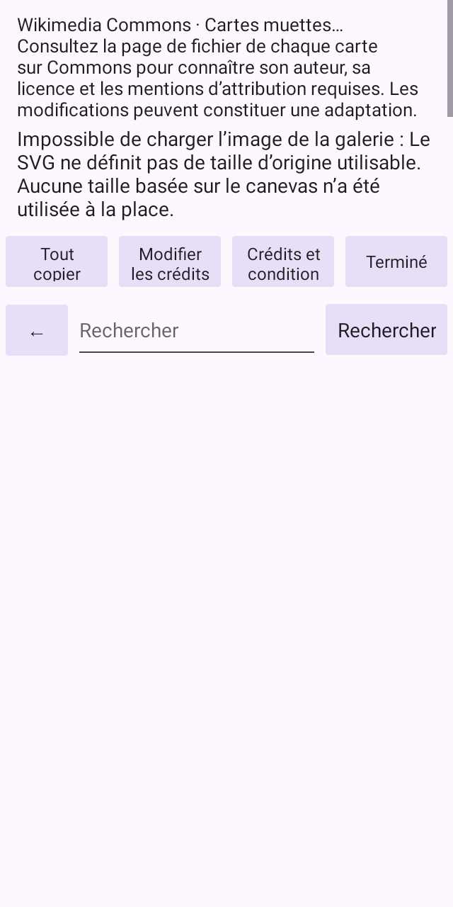

# Actual c73ad1a CI captures and failure evidence

Head `c73ad1afc91b492f27b063f9a7107cb104d87f61`.
[Workflow](https://github.com/c933103/AN-Paint/actions/runs/37917916033),
[regression job](https://github.com/c933103/AN-Paint/actions/runs/37917916033/job/113778527508).
The downloaded regression artifact is byte-verified with its official SHA256
`ea2a7e467da777967534c7b267507b8d346830543fec0c02e488ca5083d1a06e`.
The PNG/JSON/XML files here are unchanged copies from it, with a hash ledger in
[results.json](results.json).

Actual results: host checks passed 321 tests with two optional skips; JVM ran 686
with four failures. All six SVG translation-error executions passed. All four
readability executions stopped when their large-text precondition requested
Activity font scale 2.0 but received 1.0. These failures are preserved in the full
JUnit XML. They are not clipping results and must not be relabeled passes.

Before that precondition stopped the matrix, eight normal-scale native-host
captures were produced: French and Mongolian × two reasons × API30/35. Every
PNG was visually inspected. French contains both full clauses (status height
145 px). Mongolian's measured status is fully visible (261 px unavailable,
212 px too-large), but its text is sideways in horizontal lines. The JSON reports
ordinary TextView, no replacement spans and vertical_renderer_present=false.
This confirms the separate AN-W04 orientation gap. No clipping is observed in
these limited 1× status samples; no other-locale or 2× coverage is inferred.

Representative API35 captures:

These are Robolectric native-rendered host screenshots, not emulator or physical
device screenshots. The empty WebView is expected in the deterministic fixture.
No native-language, complete gallery-control layout, vertical or accessibility
acceptance follows. Source/configuration diagnosis and a corrected large-text
measurement are still required.
